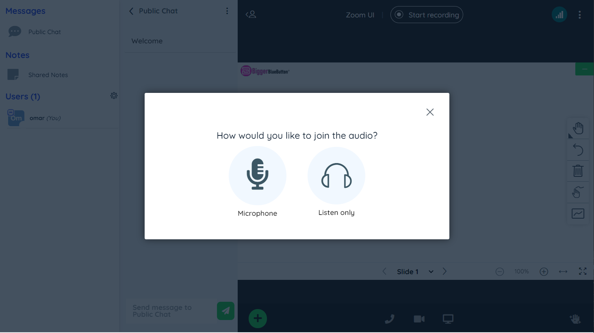
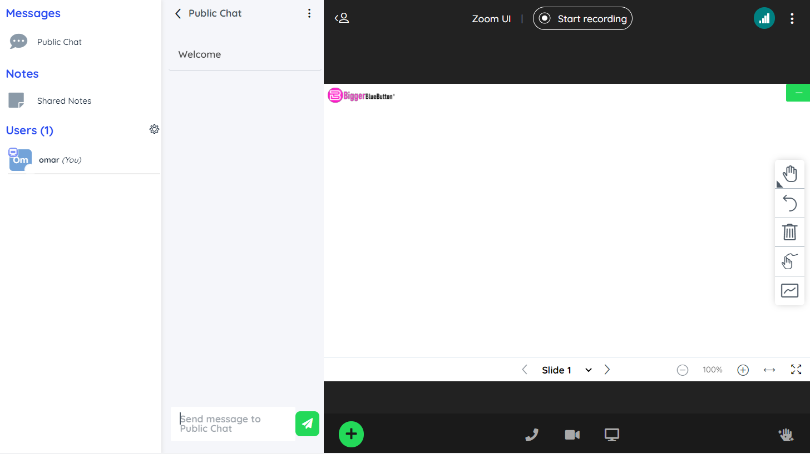
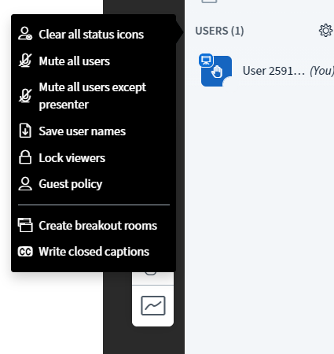

zoom theme by BiggerBlueButton
====

css theme file that gives bigbluebutton zoom appearance 

this is the default theme of biggerbluebutton meeting and you can see a live demo on our website 

## demo 
Check the live demo by creating new meeting on [biggerbluebutton](https://biggerbluebutton.com)

### main changes

- background color to dark gray
- place users list and chat list on right side
- changed color of dropdown menus to black (just like zoom)
- changed buttons color to green

### screenshots

### usage

apply this theme by adding this field to API join method 

userdata-bbb_custom_style_url=https://biggerbluebutton.com/themes/zoom.css

you can also upload zoom.css file directly to the public directory on your server and replace the URL with yours

